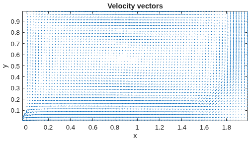
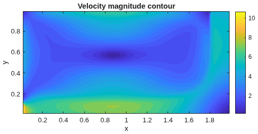
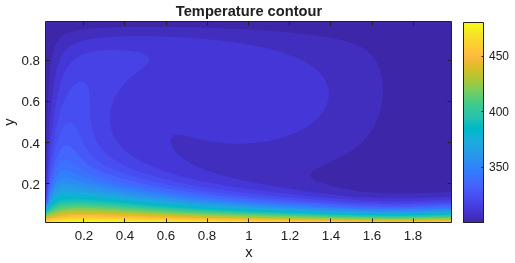
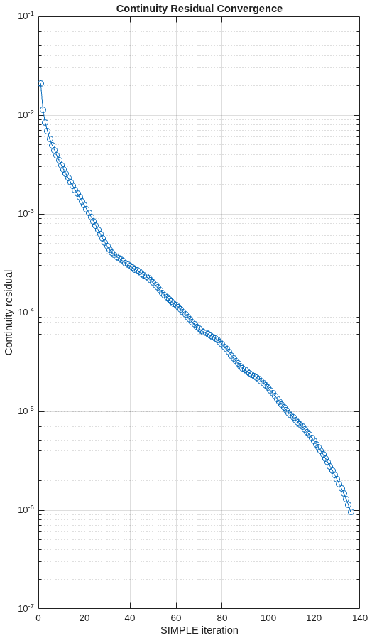
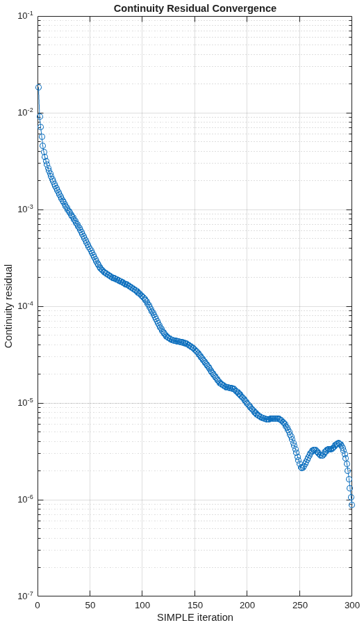
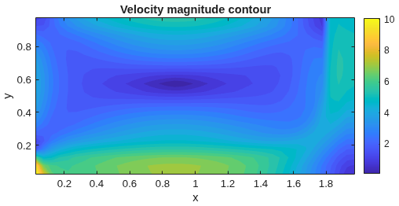

Run the solver in the main_RUN_HERE.m script.
## Results (80 × 40 grid)

## Convergence

| 40 × 20 | 80 × 40 |
|:---:|:---:|
| 

 | 

 |

Continuity residual reaches 10⁻⁶; mass imbalance is 0.002% on the 80 × 40 grid.

## Grid comparison

| 40 × 20 | 80 × 40 |
|:---:|:---:|
| 

 | 

 |
